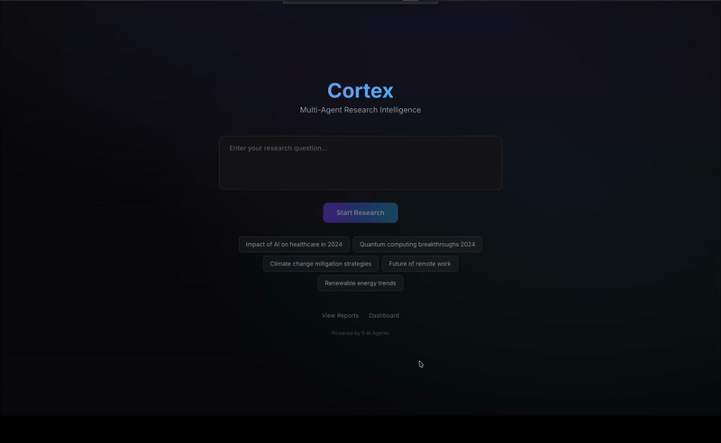

<div align="center">

# 🧠 Cortex

### Multi-Agent AI Research Platform

**5 autonomous AI agents collaborate in real-time to research any topic, analyze findings, and produce professional reports — all streamed live to your browser.**

[](LICENSE)
[](https://python.org)
[](https://nextjs.org)
[](https://typescriptlang.org)

</div>

---

## 🎬 Demo



*Ask anything → Watch 5 AI agents think, search, analyze, write, and review — all in real-time*

---

## ⚡ What Happens When You Ask a Question

```
You: "What is AI?"
```

```
 ┌─────────────────────────────────────────────────────────────┐
 │                                                             │
 │  🗂️ Planner    → Breaks query into research sub-tasks      │
 │       ↓                                                     │
 │  🔍 Researcher → Searches web, ArXiv, Wikipedia.           │
 │       ↓          Scores credibility.                        │
 │       ↓                                                     │
 │  📊 Analyst    → Finds patterns, contradictions, gaps.      │
 │       ↓          Extracts key insights.                     │
 │       ↓                                                     │
 │  ✍️ Writer     → Produces a cited, structured report.       │
 │       ↓                                                     │
 │  🔎 Critic     → Fact-checks, scores quality, requests      │
 │                  revisions if needed (max 2x).               │
 │                                                             │
 │  📄 Output: Professional report with citations,             │
 │     quality score, and cost breakdown.                      │
 │                                                             │
 │  You watch every thought in real-time via WebSocket.        │
 └─────────────────────────────────────────────────────────────┘
```

---

## 🎯 Why This Exists

| Single LLM Call | Cortex |
|---|---|
| One perspective | 5 specialized agents with distinct roles |
| No source verification | Credibility scoring + fact-checking |
| No transparency | Watch every thought in real-time |
| Hallucination-prone | Citation enforcement |
| No quality control | LLM-as-judge evaluation with revision loops |
| Unknown cost | Per-agent token & cost tracking |

---

## 🏗️ Architecture

```
┌──────────────────────── Frontend (Next.js 14) ──────────────────────┐
│  Research Input  │  Live Agent Feed  │  Report View  │  Dashboard   │
└────────────────────────────┬────────────────────────────────────────┘
                             │ WebSocket (real-time streaming)
┌────────────────────────────┴────────────────────────────────────────┐
│                      Backend (FastAPI)                               │
│                                                                     │
│  ┌────────────── Agent Orchestrator (Event Bus) ──────────────┐    │
│  │  Planner → Researcher → Analyst → Writer → Critic          │    │
│  │     ↑                                          │           │    │
│  │     └──────── Revision Loop (max 2x) ──────────┘           │    │
│  └────────────────────────────────────────────────────────────┘    │
│                                                                     │
│  ┌─────────┐  ┌───────────┐  ┌──────────┐  ┌──────────────────┐   │
│  │   RAG   │  │    LLM    │  │   Cost   │  │   Eval Pipeline  │   │
│  │Pipeline │  │  Gateway  │  │ Tracker  │  │  (LLM-as-Judge)  │   │
│  └────┬────┘  └─────┬─────┘  └──────────┘  └──────────────────┘   │
│       │             │                                               │
│  ┌────┴────┐  ┌─────┴─────┐                                       │
│  │ChromaDB │  │  Redis    │                                        │
│  │(Vectors)│  │ (Cache)   │                                        │
│  └─────────┘  └───────────┘                                        │
└─────────────────────────────────────────────────────────────────────┘
```

---

## 🛠️ Tech Stack

| Layer | Technology |
|---|---|
| **Frontend** | Next.js 14, TypeScript, Tailwind, Framer Motion |
| **Backend** | FastAPI, Python 3.11+, async/await |
| **LLM** | Claude Sonnet / GPT-4o (provider-agnostic via config) |
| **Vector DB** | ChromaDB |
| **Cache** | Redis (optional) |
| **Search** | Tavily API, Wikipedia, ArXiv |
| **Database** | SQLite (dev) / PostgreSQL (prod) |

---

## 🚀 Quick Start

### Prerequisites

- Python 3.11+
- Node.js 18+
- API Keys: [Anthropic](https://console.anthropic.com/) or [OpenAI](https://platform.openai.com/)

### Option 1: Docker

```bash
git clone https://github.com/iremsusavas/cortex.git
cd cortex
cp .env.example .env
# Add ANTHROPIC_API_KEY or OPENAI_API_KEY + PRIMARY_LLM_PROVIDER=openai

docker-compose up --build
```

Open [http://localhost:3000](http://localhost:3000)

### Option 2: Manual Setup

```bash
# 1. Backend
cd cortex
python3 -m venv .venv
source .venv/bin/activate  # Windows: .venv\Scripts\activate
pip install -r backend/requirements.txt

# 2. Copy env and add keys
cp .env.example .env

# 3. Run backend (from project root)
make dev-backend
# Or: PYTHONPATH=. uvicorn backend.main:app --reload --reload-dir backend --host 0.0.0.0 --port 8000

# 4. Frontend (new terminal)
cd frontend
npm install
npm run dev
```

### Environment Variables

```env
# Required: one of these
ANTHROPIC_API_KEY=sk-ant-xxxxx
OPENAI_API_KEY=sk-xxxxx

# Use OpenAI as primary when Anthropic has no credits
PRIMARY_LLM_PROVIDER=openai
# or: PRIMARY_LLM_PROVIDER=anthropic

# Optional (without Tavily: Wikipedia + ArXiv only)
TAVILY_API_KEY=tvly-xxxxx

# Optional
REDIS_URL=redis://localhost:6379

# Faster research for demos
MAX_SUB_TASKS=2
MAX_SOURCES_PER_TASK=2
SKIP_SCRAPING=true
```

---

## 📁 Project Structure

```
cortex/
├── backend/
│   ├── agents/          # Planner, Researcher, Analyst, Writer, Critic
│   ├── orchestrator/    # Event bus, state machine, engine
│   ├── llm/             # Gateway with caching & fallback
│   ├── rag/             # Chunking, embedding, vector store
│   ├── tools/           # Tavily, Wikipedia, ArXiv, scraper
│   ├── api/             # REST + WebSocket
│   ├── evaluation/      # LLM-as-judge
│   └── db/              # SQLAlchemy models
│
├── frontend/
│   ├── app/             # Next.js App Router pages
│   ├── hooks/           # WebSocket, research session
│   └── lib/             # API client, types
│
├── scripts/             # Eval, demo
├── docker-compose.yml
└── Makefile
```

---

## 🧠 How the Agent System Works

The **Orchestrator** runs a state machine:

```
PLANNING → RESEARCHING → ANALYZING → WRITING → REVIEWING
                                        ↑          │
                                        └── REVISING (if critic rejects, max 2x)
```

Each agent has a specialized system prompt and output schema. Events stream to the UI via WebSocket.

---

## 🧪 Production Patterns

- **Retry with backoff** — 3 attempts, exponential
- **Provider fallback** — Anthropic → OpenAI on rate limit / low credits
- **Graceful degradation** — Tavily fails → Wikipedia/ArXiv only
- **WebSocket reconnection** — Auto-reconnect
- **Per-agent cost tracking** — Token count and USD per call
- **Rate limiting** — Configurable per IP and per session

---

## 📜 License

MIT
